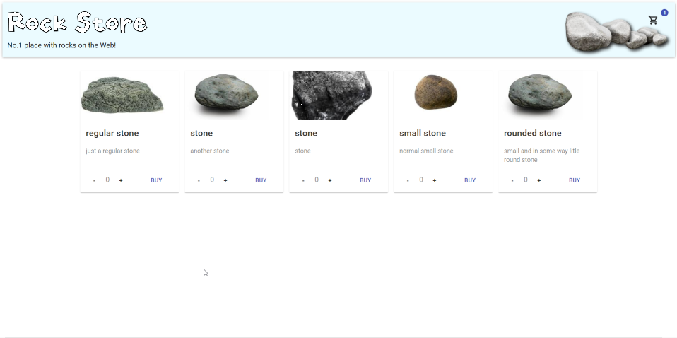
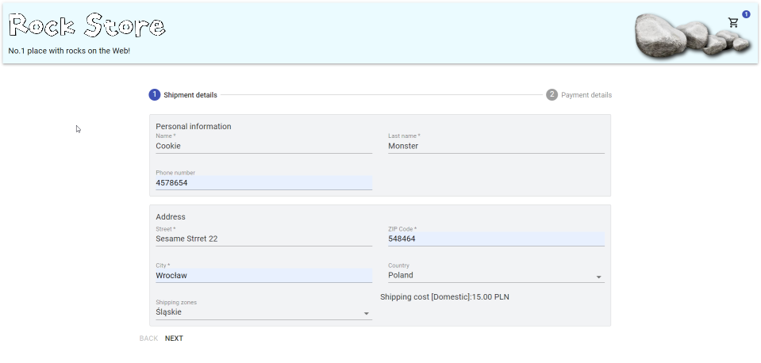
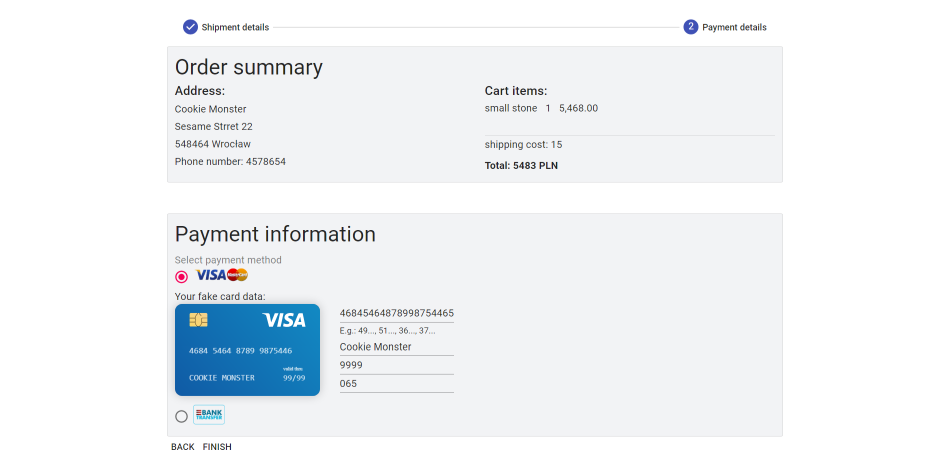

# Store with rocks
Simple store witch Commerce.js backend and MaterialUI components

Working version here: [https://rock-store.herokuapp.com](https://rock-store.herokuapp.com).

---
## Technologies used
  

## Shipping and payment forms
These are just mockups, I don't won't anybody to buy any rocks from me.  

---
## Todo
- dashboard view
- style the app
- make it more responsive
---
